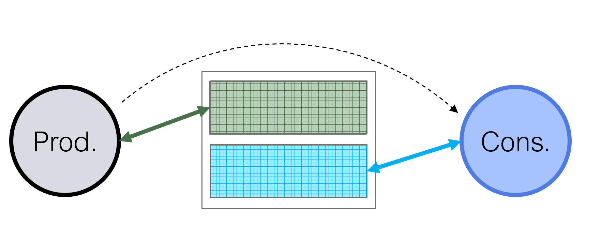

# PASTA
PASTA is built upon TAPA and adds *buffer* channel support. If you're not familiar with the TAPA project please refer to [TAPA](https://github.com/UCLA-VAST/tapa) and its documentation [here](https://tapa.rtfd.io/).

This document assumes that you're already familiar with TAPA and are actively using it and want to additionally benefit from the added features of PASTA. It contains instructions on how to build TAPA, the features it adds and how to use those features.

In TAPA tasks can communicate with each other via FIFO channels aka `tapa::stream` channels. PASTA adds support for ping-pong enabled buffer channels aka `tapa::buffer`. The `tapa::buffer` channel allows a *producer* task to *produce* an array (i.e. buffer) of data which can be sent over to the consumer task which can then read it. As already mentioned, this channel can be ping-pong buffered so that the *producer* can start *producing* the next set of data while the *consumer* is *consuming* the last sent data.

The following figure shows the ping-pong based communication happening in action. The *producer* task is writing to the green part of the buffer channel while the *consumer* is reading the blue which which the *producer* had written some time back. These *parts* are named *sections* in PASTA terminology. The common number for ping-pong configuration is to have *two* buffers aka double buffering but in PASTA this parameter is configurable by the programmer. Another common usage is to have only a single section aka a single buffer when no overlap is needed between the producer and consumer task's communication with the buffer channel.



Before I explain the behaviors, let's use the term *free* to refer to *sections* which are *free* to be written to, meaning that those sections don't contain any valid data. The term *occupied* refers to *sections* which *occupy* valid data that still needs to be consumed by the *consumer*.

## Producer Side Behavior
A *producer* task can request to *acquire* a single one of the *free* *sections*, when this is granted, the *producer* task gets to interact with this *section* in whichever way it wants. It's an addressable memory of the size the programmer specified at compile time. The *producer* can write this buffer as well as read it if it wishes to. Once the *producer* is done interacting with the *section*, it can *release* the section, which marks the *section* as *occupied*, thereby making it eligible for the *consumer* to read it.

## Consumer Side Behavior
A *consumer* task can request to *acquire* a single one of the *available* *sections*, when this is granted, the *consumer* task gets to interact with this *section* in whichever way it wants. It's an addressable memory of the size the programmer specified at compile time. The *consumer* can read from this buffer as well as write it if it wants. Once the *consumer* is done interacting with the *section*, it can *release* the section, which marks the *section* as *free*, thereby making it eligible to be written to by the *producer*.

## Declaring a buffer channel
A buffer channel declaration looks like the following:
```cpp
tapa::buffer<float[NX][NY][NZ],      // the type, followed by the dimensions and their sizes
             2,                      // the no of sections (e.g. 2 for ping-pong)
             tapa::array_partition<  // a list of partition strategy for each dimension
                tapa::normal,        // normal partitioning (no partitioning)
                tapa::cyclic<2>,     // cyclic partition with factor of 2, block is also supported
                tapa::complete       // complete partitioning
              >,
             tapa::memcore<tapa::bram> // the memcore to use, can be BRAM and URAM
             >
```

## Usage inside a producer task
```cpp
// in this example, I have pruned the type by putting ... for readability, you can also avoid writing long declarations by using the `using` keyword. Using `using` you can give short names to these types at the top of the file and use those instead
void producer(tapa::obuffer<float[NX][NY][NZ], ...>& buffer_out) {
  for (...) {
    auto section = buffer_out.acquire();
    auto& array = section();
    
    // interact with the array pretending it's just a simple BRAM array with the type
    // float[NX][NY][NZ] that has been partitioned with the given strategies using HLS pragmas
    
    // ...
    // ...

    // as soon as `section` goes out of scope, the buffer gets released
  }
}
```
## Usage inside a consumer task
```cpp
void consumer(tapa::ibuffer<float[NX][NY][NZ], ...>& buffer_in) {
  for (...) {
    auto section = buffer_in.acquire();
    auto& array = section();
    
    // interact with the array pretending it's just a simple BRAM array with the type
    // float[NX][NY][NZ] that has been partitioned with the given strategies using HLS pragmas
    
    // ...
    // ...

    // as soon as `section` goes out of scope, the buffer gets released
  }
}
```

## Installation Process
If you have `sudo` access, the installation process is exactly the same as that of manually building TAPA, except that you need to make sure when installing the python package for TAPA you use our [PASTA](https://github.com/SFU-HiAccel/tapa) repository's `integrate-buffer` branch and when installing the python package for [Autobridge](https://github.com/SFU-HiAccel/autobridge-private) you use our autobridge repository's `integrate-buffer`. I'd further suggest making the packages editable by doing `pip3 install --editable .` so you don't have to reinstall everytime you pull new changes in my branch. Along with installing the Python packages, you need to make sure you create the symlinks to install the cpp header files, the tapacc utility and the library files as mentioned in the TAPA docs [here](https://tapa.readthedocs.io/en/release/installation.html#build-and-installation).

If you don't have `sudo` access, things become slightly harder. While the Python packages you can easily install in a private conda environment created inside your own installation of `miniconda`, you can create the symlinks for cpp header files, the tapacc utility and the library files in `~/.local` and then make sure these are reachable.

```bash
sudo ln -sf "${PWD}"/backend/tapacc ~/.local/bin/
sudo ln -sf "${PWD}"/../src/tapa{,.h} ~/.local/include/
sudo ln -sf "${PWD}"/libtapa.{a,so} ~/.local/lib/
```

You can make sure that these are reachable by ensuring that `~/.local/bin` is in `PATH`, `~/.local/lib` is in `LD_LIBRARY_PATH` and `~/.local/include` is in `CPATH`. This will help `g++`/`clang++` find the header and library files when you're trying to do a software simulation and it'll help `tapac` find the `tapacc` utility as well as help `vitis_hls` find the include files when it's invoked under the hood by `tapac`.

To enable buffer support, you just need to ensure that you pass a couple of flags when using different flows.

For software simulation, you want to make sure you pass a `-DTAPA_BUFFER_SUPPORT` and standard to be C++17 flag.
```bash
g++ -o vadd -O2 kernel.cpp kernel-host.cpp -ltapa -lfrt -lglog -lgflags -lOpenCL -DTAPA_BUFFER_SUPPORT -std=c++17
```
When invoking `tapac`, make sure to pass `--enable-buffer-support` to ensure that buffer support is enabled.

## Disclaimer
This is actively under development, so I apologize for any bugs that you may encounter. There are already some that I am going to be working on solving. In anycase, I'm always available for help at `moazin_khatti@sfu.ca`. 

## Paper
You can also find more details about this work in our FCCM 2023 paper.
> M. Khatti, X. Tian, Y. Chi, L. Guo, J. Cong and Z. Fang, "PASTA: Programming and Automation Support for Scalable Task-Parallel HLS Programs on Modern Multi-Die FPGAs," 2023 IEEE 31st Annual International Symposium on Field-Programmable Custom Computing Machines (FCCM), Marina Del Rey, CA, USA, 2023, pp. 12-22, doi: 10.1109/FCCM57271.2023.00011.